# DIAGRAMA DE FLUJO COMPLETO - PS COMERCIAL

> **Fuente**: ESTADOS-POR-MODULO.md
> **Fecha**: 2025-12-17
> **Versión**: 1.0

---

## Diagrama Mermaid - Flujo Completo del Proceso Comercial

```mermaid
flowchart TD
    subgraph LEAD[MODULO LEAD]
        direction TB
        L_INICIO([Nuevo Lead])
        L_PEND_ASIG[PENDIENTE_ASIGNACION]
        L_PEND_INFO[PENDIENTE_INFORMACION]
        L_ASIGNADO[ASIGNADO]
        L_DEC_DATOS{Datos completos}
        L_DEC_VALIDO{Lead valido}
        L_CONVERTIDO([CONVERTIDO])
        L_RECHAZADO([RECHAZADO])
    end

    L_INICIO --> L_PEND_ASIG
    L_PEND_ASIG --> L_DEC_DATOS
    L_DEC_DATOS -->|NO| L_PEND_INFO
    L_DEC_DATOS -->|SI| L_ASIGNADO
    L_PEND_INFO -->|Completa datos| L_PEND_ASIG
    L_ASIGNADO --> L_DEC_VALIDO
    L_DEC_VALIDO -->|SI| L_CONVERTIDO
    L_DEC_VALIDO -->|NO| L_RECHAZADO

    subgraph COTIZACION[MODULO COTIZACION]
        direction TB
        C_CREACION[CREACION_OFERTA]
        C_DEC_MARGEN{Margen minimo}
        C_PEND_APROB[PENDIENTE_APROBACION_MARGEN]
        C_NEGOCIACION[NEGOCIACION]
        C_RIESGO[RIESGO]
        C_DEC_TIPO{Tipo cliente}
        C_ENVIADA[ENVIADA_CLIENTE]
        C_PROFORMA_ENV[PROFORMA_ENVIADA]
        C_DEC_RESP{Respuesta cliente}
        C_ACEPTADA[ACEPTADA_CLIENTE]
        C_PEND_AJUSTES[PENDIENTE_AJUSTES]
        C_RECHAZADA([RECHAZADA_CLIENTE])
        C_PENDIENTE_OC[PENDIENTE_OC]
        C_PERDIDA([PERDIDA])
    end

    L_CONVERTIDO --> C_CREACION
    C_CREACION --> C_DEC_MARGEN
    C_DEC_MARGEN -->|NO| C_PEND_APROB
    C_DEC_MARGEN -->|SI| C_NEGOCIACION

    subgraph APROBACION[APROBACION MARGEN]
        direction TB
        A_PENDIENTE[PENDIENTE]
        A_DEC{Gerencia aprueba}
        A_APROBADA([APROBADA])
        A_RECHAZADA([RECHAZADA])
    end

    C_PEND_APROB --> A_PENDIENTE
    A_PENDIENTE --> A_DEC
    A_DEC -->|SI| A_APROBADA
    A_DEC -->|NO| A_RECHAZADA
    A_APROBADA --> C_NEGOCIACION
    A_RECHAZADA --> C_PERDIDA

    C_NEGOCIACION --> C_DEC_TIPO
    C_NEGOCIACION -->|Baja probabilidad| C_RIESGO
    C_NEGOCIACION -->|No interesado| C_PERDIDA
    C_RIESGO -->|Retoma| C_NEGOCIACION
    C_RIESGO -->|Descarta| C_PERDIDA

    C_DEC_TIPO -->|CON CREDITO| C_ENVIADA
    C_DEC_TIPO -->|SIN CREDITO| C_PROFORMA_ENV

    C_ENVIADA --> C_DEC_RESP
    C_PROFORMA_ENV --> C_DEC_RESP

    C_DEC_RESP -->|ACEPTA| C_ACEPTADA
    C_DEC_RESP -->|AJUSTES| C_PEND_AJUSTES
    C_DEC_RESP -->|RECHAZA| C_RECHAZADA

    C_PEND_AJUSTES -->|Reenvia| C_ENVIADA
    C_PEND_AJUSTES -->|Reenvia proforma| C_PROFORMA_ENV

    subgraph VALIDACION[VALIDACION FINANCIERA PRE-PEDIDO]
        direction TB
        V_INICIO[Cotizacion Aceptada]
        V_DEC_BLOQUEO{Bloqueo cartera HU-0004}
        V_CON_BLOQUEO[CON_BLOQUEO]
        V_SIN_BLOQUEO[SIN_BLOQUEO]
        V_DEC_PAGO{Forma de pago}
        V_ANTICIPADO[Pago Anticipado]
        V_CREDITO[Credito Aprobado]
        V_DEC_CONFIRMADO{Pago confirmado HU-0006}
        V_PAGO_OK[Pago Verificado]
        V_PAGO_PEND[Esperando pago]
        V_LISTO([VALIDACION OK])
    end

    C_ACEPTADA --> V_INICIO
    V_INICIO --> V_DEC_BLOQUEO
    V_DEC_BLOQUEO -->|SI| V_CON_BLOQUEO
    V_DEC_BLOQUEO -->|NO| V_SIN_BLOQUEO
    V_CON_BLOQUEO -->|Financiera desbloquea| V_SIN_BLOQUEO
    V_SIN_BLOQUEO --> V_DEC_PAGO
    V_DEC_PAGO -->|ANTICIPADO| V_ANTICIPADO
    V_DEC_PAGO -->|CREDITO| V_CREDITO
    V_ANTICIPADO --> V_DEC_CONFIRMADO
    V_DEC_CONFIRMADO -->|NO| V_PAGO_PEND
    V_DEC_CONFIRMADO -->|SI| V_PAGO_OK
    V_PAGO_PEND -->|Financiera confirma| V_PAGO_OK
    V_PAGO_OK --> V_LISTO
    V_CREDITO --> V_LISTO

    V_LISTO --> C_PENDIENTE_OC

    subgraph PROFORMA[MODULO PROFORMA]
        direction TB
        PR_GENERADA[GENERADA]
        PR_ENVIADA[ENVIADA]
        PR_PEND_PAGO[PENDIENTE_PAGO]
        PR_PAGO_CONF([PAGO_CONFIRMADO])
    end

    C_PROFORMA_ENV -.->|Genera PDF| PR_GENERADA
    PR_GENERADA --> PR_ENVIADA
    PR_ENVIADA --> PR_PEND_PAGO
    PR_PEND_PAGO --> PR_PAGO_CONF
    PR_PAGO_CONF -.->|Actualiza| V_PAGO_OK

    subgraph PEDIDO[MODULO PEDIDO]
        direction TB
        P_CREADO[CREADO]
        P_DEC_FORMA{Forma de pago}
        P_PAGO_CONF[PAGO_CONFIRMADO]
        P_DISP_COMPRA[DISPONIBLE_COMPRA]
        P_EN_PROCESO[EN_PROCESO]
    end

    C_PENDIENTE_OC -->|OC cliente recibida| P_CREADO
    P_CREADO --> P_DEC_FORMA
    P_DEC_FORMA -->|ANTICIPADO| P_PAGO_CONF
    P_DEC_FORMA -->|CREDITO| P_DISP_COMPRA
    P_PAGO_CONF --> P_EN_PROCESO
    P_DISP_COMPRA --> P_EN_PROCESO

    subgraph OC[MODULO ORDEN DE COMPRA]
        direction TB
        OC_CREADA[CREADA]
        OC_ENVIADA[ENVIADA_PROVEEDOR]
        OC_CONFIRMADA[CONFIRMADA]
        OC_TRANSITO[EN_TRANSITO]
        OC_RECIBIDA([RECIBIDA])
    end

    P_EN_PROCESO --> OC_CREADA
    OC_CREADA --> OC_ENVIADA
    OC_ENVIADA --> OC_CONFIRMADA
    OC_CONFIRMADA --> OC_TRANSITO
    OC_TRANSITO --> OC_RECIBIDA
```

---

## Leyenda de Colores

| Color | Módulo |
|-------|--------|
| 🔵 Azul claro | LEAD |
| 🟠 Naranja | COTIZACIÓN |
| 🔴 Rosa | VALIDACIÓN FINANCIERA |
| 🟢 Verde | PEDIDO |
| 🟣 Púrpura | ORDEN DE COMPRA |
| 🟡 Amarillo | PROFORMA |
| 🌊 Teal | APROBACIÓN MARGEN |
| ✅ Verde oscuro | Estado final exitoso |
| ❌ Rojo | Estado final fallido |
| 💛 Amarillo claro | Decisión/Condición |

---

## Puntos Críticos del Flujo

### 🚨 VALIDACIÓN FINANCIERA (HU-0004, HU-0006)

**Sin esta validación NO se puede generar pedido:**

1. **Bloqueo de Cartera** (HU-0004)
   - Área Financiera marca: Sí/No
   - Si hay bloqueo → Cotización se guarda pero NO genera pedido

2. **Confirmación de Pago** (HU-0006)
   - Solo para clientes con pago anticipado (sin crédito)
   - Financiera verifica soporte de pago
   - Sin confirmación → NO genera pedido

### 📊 Resumen de Estados por Módulo

| Módulo | Estados | Inicial | Final OK | Final Fail |
|--------|---------|---------|----------|------------|
| LEAD | 5 | PENDIENTE_ASIGNACION | CONVERTIDO | RECHAZADO |
| COTIZACIÓN | 11 | CREACION_OFERTA | PENDIENTE_OC | PERDIDA, RECHAZADA |
| VALIDACIÓN | 2 | - | SIN_BLOQUEO | CON_BLOQUEO |
| PEDIDO | 4 | CREADO | EN_PROCESO | - |
| OC | 5 | CREADA | RECIBIDA | - |
| PROFORMA | 4 | GENERADA | PAGO_CONFIRMADO | - |
| APROBACIÓN | 3 | PENDIENTE | APROBADA | RECHAZADA |

---

**Documento generado por**: @business-analyst
**Fecha**: 2025-12-17
