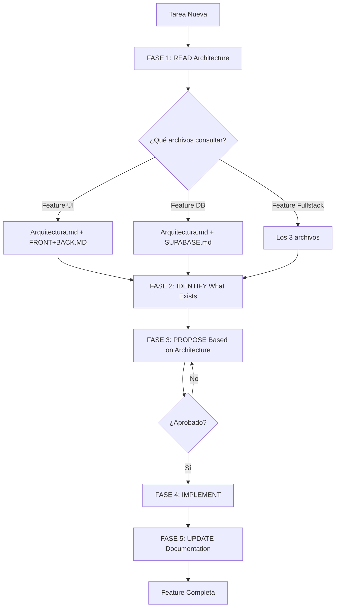

# PLAN DE ACTUALIZACIÓN DE AGENTES - ARQUITECTURA KNOWLEDGE-DRIVEN

**Fecha**: 2025-10-29
**Objetivo**: Integrar archivos de arquitectura como fuente de verdad para todos los agentes

---

## 🎯 OBJETIVOS

### 1. **Knowledge Base Integration**
Todos los agentes deben consultar los archivos de arquitectura ANTES de proponer o realizar cambios:
- `/workspaces/Podenza/Context/Rules/Arquitectura.md`
- `/workspaces/Podenza/Context/Rules/FRONT+BACK.MD`
- `/workspaces/Podenza/Context/Rules/SUPABASE.md`

### 2. **Holistic Planning**
Los agentes deben:
- Identificar QUÉ existe antes de modificar
- Comprender dependencias y arquitectura actual
- Proponer soluciones aterrizadas a la realidad del proyecto

### 3. **Documentation Update Loop**
Después de cambios aprobados:
- Agentes deben actualizar los archivos de arquitectura
- Mantener sincronizada la documentación con el código
- Registrar decisiones arquitectónicas

---

## 📚 MEJORES PRÁCTICAS IDENTIFICADAS

### De la Investigación Web

#### 1. **Context Engineering** (Anthropic)
> "CLAUDE.md es usado para codificar convenciones del proyecto, comandos de prueba, diseño de directorios y notas de arquitectura para que los agentes converjan en estándares compartidos"

**Aplicación**:
- Los 3 archivos de arquitectura son nuestro "CLAUDE.md expandido"
- Cada agente debe leerlos al inicio de CADA tarea
- Usar como referencia para validar propuestas

#### 2. **Holistic Planning** (AI Agent Best Practices)
> "La planificación holística enfatiza planificación comprehensiva—considerando TODOS los archivos, dependencias y contexto—para asegurar soluciones robustas y libres de errores"

**Aplicación**:
- ANTES de proponer cambios: leer Arquitectura.md + FRONT+BACK.MD + SUPABASE.md
- Identificar archivos y componentes afectados
- Validar contra patrones establecidos

#### 3. **Before Making Changes** (Effective Context Engineering)
> "El modelo preserva decisiones arquitectónicas, bugs no resueltos y detalles de implementación mientras descarta outputs redundantes"

**Aplicación**:
- Fase 1: READ - Consultar arquitectura actual
- Fase 2: PLAN - Proponer cambios basados en arquitectura
- Fase 3: EXECUTE - Implementar SOLO después de validación
- Fase 4: UPDATE - Actualizar documentación de arquitectura

#### 4. **Modular Prompts** (System Prompt Architecture)
> "La implementación varía según la arquitectura del agente y objetivos, incluyendo prompts modulares a través de múltiples archivos"

**Aplicación**:
- Cada agente tiene su especialización
- Pero TODOS comparten las mismas referencias de arquitectura
- Sección común: "ARQUITECTURA KNOWLEDGE BASE"

---

## 🔄 NUEVO WORKFLOW PARA TODOS LOS AGENTES

### FASE 1: READ ARCHITECTURE (OBLIGATORIO)

```markdown
## 📖 ARQUITECTURA KNOWLEDGE BASE

**IMPORTANTE**: ANTES de cualquier tarea, SIEMPRE consultar:

### 1. Arquitectura General
**Archivo**: `/workspaces/Podenza/Context/Rules/Arquitectura.md`
**Contenido**: Estructura del proyecto, convenciones, patrones establecidos
**Cuándo leer**:
- Antes de proponer nuevas features
- Antes de modificar estructuras existentes
- Al inicio de cualquier tarea de desarrollo

### 2. Integración Frontend-Backend
**Archivo**: `/workspaces/Podenza/Context/Rules/FRONT+BACK.MD`
**Contenido**: Flujos completos UI → Backend → Supabase, patrones de integración
**Cuándo leer**:
- Antes de crear nuevos componentes
- Antes de crear nuevas queries/mutations
- Al implementar features fullstack
- Al modificar flujos de datos

### 3. Base de Datos Supabase
**Archivo**: `/workspaces/Podenza/Context/Rules/SUPABASE.md`
**Contenido**: Schemas, tablas, RLS policies, funciones, triggers
**Cuándo leer**:
- Antes de crear migraciones
- Antes de modificar queries
- Al trabajar con autenticación
- Al implementar RLS policies
```

### FASE 2: IDENTIFY WHAT EXISTS

```markdown
## 🔍 PROCESO DE IDENTIFICACIÓN

Antes de modificar CUALQUIER archivo:

1. **Buscar componentes relacionados**
   ```bash
   # Ejemplo: Si vas a crear users-list.tsx
   find . -name "*user*" -o -name "*list*"
   grep -r "UsersList" apps/web/
   ```

2. **Consultar Arquitectura.md**
   - ¿Ya existe este módulo?
   - ¿Qué patrones usa?
   - ¿Dónde debería ubicarse?

3. **Consultar FRONT+BACK.MD**
   - ¿Cómo se integra con backend?
   - ¿Qué queries usa?
   - ¿Qué patrones de estado usa?

4. **Consultar SUPABASE.md**
   - ¿Qué tablas afecta?
   - ¿Qué RLS policies aplican?
   - ¿Qué relaciones tiene?
```

### FASE 3: PROPOSE BASED ON ARCHITECTURE

```markdown
## 💡 PROPUESTA ARQUITECTÓNICAMENTE VALIDADA

Al proponer cambios:

### ✅ HACER:
- Citar secciones específicas de arquitectura
- Referenciar patrones existentes similares
- Explicar cómo se integra con arquitectura actual
- Listar archivos que se afectarán

### Formato de Propuesta:
"""
## 🏛️ Propuesta Basada en Arquitectura

### Análisis de Arquitectura Actual
- **Archivo consultado**: Arquitectura.md, líneas XX-YY
- **Patrón similar existente**: [Módulo X]
- **Componentes afectados**:
  - apps/web/lib/[modulo]/components/
  - apps/web/lib/[modulo]/data/queries.ts

### Integración Frontend-Backend
- **Referencia**: FRONT+BACK.MD, sección "Módulo de X"
- **Flujo**: [Describir usando mismo patrón]
- **Queries nuevas**: [Listar según patrón en queries.ts]

### Base de Datos
- **Tablas afectadas**: [según SUPABASE.md]
- **RLS policies**: [según patrones existentes]
- **Relaciones**: [según esquema]

### Propuesta de Implementación
[Código basado en patrones existentes]
"""
```

### FASE 4: UPDATE DOCUMENTATION (DESPUÉS DE APROBACIÓN)

```markdown
## 📝 ACTUALIZACIÓN DE DOCUMENTACIÓN

Después de implementar cambios aprobados:

### 1. Actualizar Arquitectura.md
Si agregaste:
- Nueva estructura de carpetas → Actualizar sección "Estructura de Directorios"
- Nuevo patrón → Agregar a sección "Patrones de Desarrollo"
- Nueva convención → Documentar en sección correspondiente

### 2. Actualizar FRONT+BACK.MD
Si agregaste:
- Nuevo módulo → Crear sección completa con flujos
- Nuevo componente importante → Agregar a estructura de archivos
- Nueva query → Documentar en sección de queries

### 3. Actualizar SUPABASE.md
Si modificaste:
- Schema → Actualizar sección de tablas
- RLS policy → Documentar en sección de policies
- Función/Trigger → Agregar a sección correspondiente

### Template de Actualización:
"""
## 📋 ACTUALIZACIÓN DE ARQUITECTURA

**Feature implementada**: [Nombre]
**Fecha**: [YYYY-MM-DD]
**Agente**: @[nombre-agente]

### Archivos de Arquitectura Actualizados:

#### Arquitectura.md
- **Sección modificada**: [nombre]
- **Cambio**: [descripción]
- **Líneas**: [XX-YY]

#### FRONT+BACK.MD
- **Sección modificada**: [nombre]
- **Nuevo contenido**: [descripción]

#### SUPABASE.md
- **Tabla/Policy/Función**: [nombre]
- **Cambio**: [descripción]
"""
```

---

## 🔨 CAMBIOS ESPECÍFICOS POR AGENTE

### 1. **coordinator.md**
**Añadir sección**:
```markdown
## 📖 ARQUITECTURA KNOWLEDGE BASE
[Sección completa FASE 1]

## 🔄 WORKFLOW ACTUALIZADO

### Al Recibir Solicitud de Feature
1. ✅ Leer Arquitectura.md + FRONT+BACK.MD + SUPABASE.md
2. ✅ Identificar módulos/componentes similares existentes
3. ✅ Buscar archivos relacionados con grep/find
4. ✅ Validar contra patrones establecidos
5. ✅ Asignar a agentes con contexto arquitectónico
6. ✅ Después de implementación: actualizar docs de arquitectura
```

### 2. **fullstack-dev.md**
**Añadir después de "CONTEXTO OBLIGATORIO"**:
```markdown
## 📖 ARQUITECTURA KNOWLEDGE BASE
[Sección completa FASE 1]

## 🔍 ANTES DE IMPLEMENTAR

### Checklist Pre-Implementación
- [ ] Leí Arquitectura.md sección relevante
- [ ] Leí FRONT+BACK.MD para módulo similar
- [ ] Busqué componentes existentes similares
- [ ] Identifiqué patrones a seguir
- [ ] Validé estructura de archivos correcta
- [ ] Verifiqué queries existentes en SUPABASE.md

### Checklist Post-Implementación
- [ ] Actualicé Arquitectura.md si cambié estructura
- [ ] Actualicé FRONT+BACK.MD si agregué flujo nuevo
- [ ] Documenté decisiones arquitectónicas
```

### 3. **db-integration.md**
**Añadir después de "MCP SUPABASE INTEGRATION"**:
```markdown
## 📖 ARQUITECTURA KNOWLEDGE BASE
[Sección completa FASE 1]

## 🔍 ANTES DE CREAR MIGRACIÓN

### Checklist Pre-Migración
- [ ] Leí SUPABASE.md sección de schemas
- [ ] Identifiqué tablas relacionadas existentes
- [ ] Verifiqué patrones de RLS similares
- [ ] Consulté convenciones de naming
- [ ] Validé índices necesarios

### Checklist Post-Migración
- [ ] Actualicé SUPABASE.md con nueva tabla/schema
- [ ] Documenté RLS policies nuevas
- [ ] Registré funciones/triggers creados
- [ ] Actualicé diagrama ER si es necesario
```

### 4. **arquitecto.md**
**Añadir sección especial**:
```markdown
## 📖 ARQUITECTURA KNOWLEDGE BASE - GUARDIAN ROLE

Como Guardian de Arquitectura, este agente tiene responsabilidad ESPECIAL:

### ANTES de Validar Implementaciones
1. ✅ Leer los 3 archivos de arquitectura COMPLETAMENTE
2. ✅ Identificar secciones relevantes para la implementación
3. ✅ Comparar código propuesto vs patrones en arquitectura
4. ✅ Validar cumplimiento con convenciones documentadas

### DESPUÉS de Aprobar Cambios
1. ✅ Revisar si algún archivo de arquitectura necesita actualización
2. ✅ Proponer actualizaciones específicas a los archivos
3. ✅ Validar que documentación refleja nueva realidad
4. ✅ Mantener coherencia entre código y documentación

### Responsabilidad de Actualización de Docs
- **Arquitectura.md**: Actualizar cuando cambien patrones/estructura
- **FRONT+BACK.MD**: Actualizar cuando cambien flujos de integración
- **SUPABASE.md**: Actualizar cuando cambien schemas/policies

### Template de Validación Arquitectónica
"""
## 🏛️ Validación Arquitectónica

### Archivos de Arquitectura Consultados
- [ ] Arquitectura.md (Secciones: [lista])
- [ ] FRONT+BACK.MD (Secciones: [lista])
- [ ] SUPABASE.md (Secciones: [lista])

### Patrones Identificados
- **Patrón similar**: [referencia a archivo:línea]
- **Convenciones aplicables**: [lista]

### Cumplimiento
- [ ] ✅ Sigue estructura documentada en Arquitectura.md
- [ ] ✅ Usa patrones de FRONT+BACK.MD
- [ ] ✅ Respeta schemas de SUPABASE.md

### Actualizaciones Requeridas a Docs
- [ ] Arquitectura.md: [sección] - [cambio necesario]
- [ ] FRONT+BACK.MD: [sección] - [cambio necesario]
- [ ] SUPABASE.md: [sección] - [cambio necesario]
"""
```

### 5. **designer-ux-ui.md**
**Añadir**:
```markdown
## 📖 ARQUITECTURA KNOWLEDGE BASE
[Sección FASE 1 enfocada en UI]

## 🎨 ANTES DE VALIDAR UI

### Consultar Arquitectura
- [ ] Leí Arquitectura.md sección de Branding
- [ ] Leí FRONT+BACK.MD para ver componentes similares
- [ ] Identifiqué patrones de UI existentes
- [ ] Validé estructura de componentes

### Post-Validación
- [ ] Actualicé Arquitectura.md si cambió sistema de diseño
- [ ] Documenté nuevos patrones de UI
```

### 6. **security-qa.md**
**Añadir**:
```markdown
## 📖 ARQUITECTURA KNOWLEDGE BASE
[Sección FASE 1 enfocada en seguridad]

## 🔒 ANTES DE SECURITY REVIEW

### Checklist Arquitectónico
- [ ] Leí SUPABASE.md sección de RLS policies
- [ ] Verifiqué patrones de seguridad existentes
- [ ] Identifiqué validaciones estándar
- [ ] Consulté multi-tenancy patterns

### Post-Review
- [ ] Actualicé SUPABASE.md si cambió RLS
- [ ] Documenté nuevos patrones de seguridad
```

### 7. **testing-expert.md**, **business-analyst.md**, **ai-automation.md**
**Añadir sección estándar**:
```markdown
## 📖 ARQUITECTURA KNOWLEDGE BASE
[Sección completa FASE 1]

## 🔍 WORKFLOW ARQUITECTÓNICO
1. **Antes**: Consultar archivos de arquitectura relevantes
2. **Durante**: Seguir patrones documentados
3. **Después**: Actualizar docs si cambió algo significativo
```

---

## 📋 README.md - ACTUALIZACIÓN

### Nueva Sección a Agregar:

```markdown
## 📚 ARQUITECTURA KNOWLEDGE BASE

**IMPORTANTE**: Todos los agentes deben consultar estos archivos ANTES de cualquier tarea:

### Archivos de Referencia Obligatoria

#### 1. `/Context/Rules/Arquitectura.md`
- **Contenido**: Estructura del proyecto, convenciones, patrones establecidos
- **Cuándo consultar**: Siempre, al inicio de cualquier tarea
- **Actualizar**: Cuando cambien patrones o estructura

#### 2. `/Context/Rules/FRONT+BACK.MD`
- **Contenido**: Flujos Frontend → Backend → Supabase, integraciones completas
- **Cuándo consultar**: Antes de implementar features fullstack
- **Actualizar**: Cuando se agreguen nuevos módulos o flujos

#### 3. `/Context/Rules/SUPABASE.md`
- **Contenido**: Schemas, tablas, RLS policies, funciones, triggers
- **Cuándo consultar**: Antes de migraciones o cambios en BD
- **Actualizar**: Cuando cambien schemas o policies

### Workflow Architecture-Driven



### Responsabilidades de Actualización

| Agente | Actualiza Arquitectura.md | Actualiza FRONT+BACK.MD | Actualiza SUPABASE.md |
|--------|---------------------------|-------------------------|----------------------|
| coordinator | ✅ Coordina actualizaciones | ✅ Valida completitud | ✅ Valida completitud |
| arquitecto | ✅✅ Guardian principal | ✅✅ Guardian principal | ✅✅ Guardian principal |
| fullstack-dev | ✅ Si cambia estructura | ✅ Si agrega flujos | - |
| db-integration | - | ✅ Si modifica queries | ✅✅ Siempre |
| designer-ux-ui | ✅ Si cambia UI system | ✅ Si cambia componentes | - |
| security-qa | - | - | ✅ Si cambia RLS |
| testing-expert | - | ✅ Si documenta tests | - |
| business-analyst | ✅ Si cambian reglas | - | - |
| ai-automation | ✅ Si agrega automatización | ✅ Si agrega flujos IA | - |
```

---

## 🎯 BENEFICIOS ESPERADOS

### 1. **Consistency (Consistencia)**
- Todos los agentes seguirán los mismos patrones
- Propuestas alineadas con arquitectura actual
- Código homogéneo y predecible

### 2. **Context Preservation (Preservación de Contexto)**
- Decisiones arquitectónicas documentadas
- Patrones reutilizables identificados
- Historia de cambios mantenida

### 3. **Reduced Errors (Menos Errores)**
- Validación contra arquitectura existente
- Identificación temprana de conflictos
- Mejor comprensión de dependencias

### 4. **Faster Onboarding (Incorporación Rápida)**
- Nuevos agentes/features siguen patrones claros
- Documentación siempre actualizada
- Menos tiempo buscando "cómo se hace X"

### 5. **Living Documentation (Documentación Viva)**
- Docs actualizados automáticamente
- Sincronización código-documentación
- Fuente de verdad confiable

---

## ✅ CHECKLIST DE IMPLEMENTACIÓN

### Fase 1: Preparación
- [ ] Crear este plan de actualización
- [ ] Validar con usuario
- [ ] Obtener aprobación para proceder

### Fase 2: Actualización de Agentes
- [ ] Actualizar coordinator.md
- [ ] Actualizar fullstack-dev.md
- [ ] Actualizar db-integration.md
- [ ] Actualizar arquitecto.md (role especial)
- [ ] Actualizar designer-ux-ui.md
- [ ] Actualizar security-qa.md
- [ ] Actualizar testing-expert.md
- [ ] Actualizar business-analyst.md
- [ ] Actualizar ai-automation.md

### Fase 3: Actualización de README
- [ ] Agregar sección "ARQUITECTURA KNOWLEDGE BASE"
- [ ] Agregar diagrama de workflow
- [ ] Agregar tabla de responsabilidades

### Fase 4: Validación
- [ ] Testear workflow con feature real
- [ ] Validar que agentes consultan arquitectura
- [ ] Verificar proceso de actualización de docs

---

## 📖 REFERENCIAS

### Fuentes de Mejores Prácticas
1. **Anthropic - Claude Code Best Practices**
   - Context Engineering
   - CLAUDE.md pattern
   - Modular prompts

2. **AI Agent Architecture Best Practices**
   - Holistic planning
   - Knowledge base integration
   - System prompt architecture

3. **Effective Context Engineering**
   - Before making changes
   - Context preservation
   - Continuous refinement

---

**Versión**: 1.0
**Creado**: 2025-10-29
**Autor**: Claude Code
**Estado**: Pendiente de Aprobación
