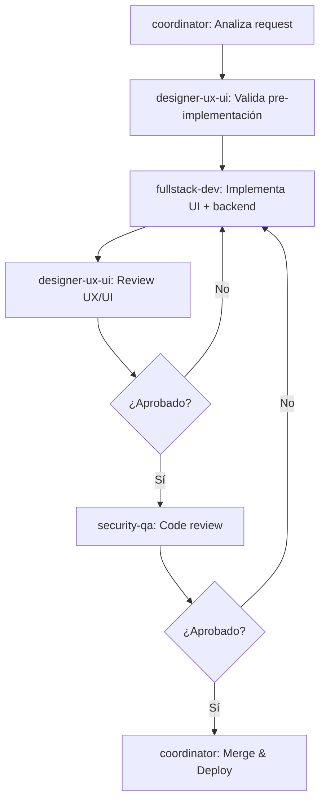
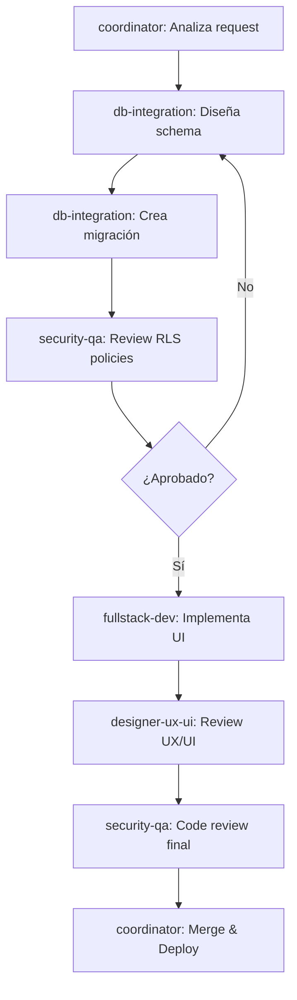
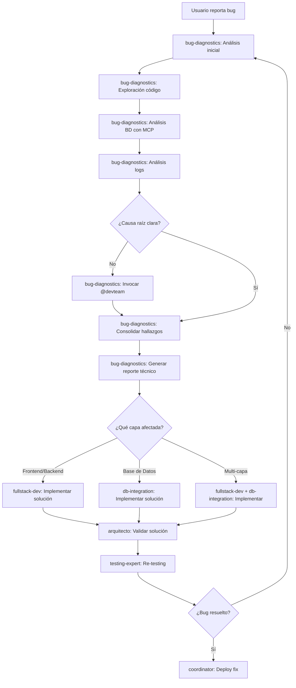
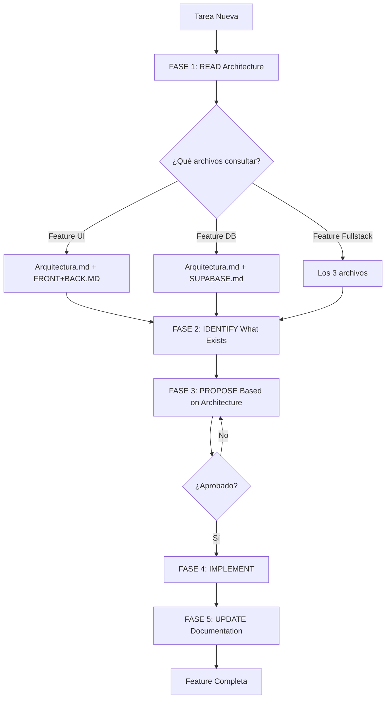

# SISTEMA DE AGENTES PODENZA

## 📋 Overview

Este directorio contiene todos los agentes especializados del equipo de desarrollo PODENZA. Cada agente tiene responsabilidades específicas y trabaja en coordinación para implementar features completas de alta calidad.

---

## 👥 AGENTES DISPONIBLES

### 1. **coordinator** - Coordinador de Proyecto
**Archivo**: `coordinator.md` (574 líneas)
**Especialización**: Coordinación de equipo + Gestión de proyecto + Priorización
**Autoridad**: Máxima - Orquestador del equipo

**Responsabilidades**:
- Priorizar tareas según Plan de Trabajo
- Coordinar entre agentes especializados
- Resolver bloqueos y dependencias
- Gestionar sprints y releases
- Mantener documentación actualizada

**Cuándo invocar**:
```
@coordinator "Analizar e implementar [feature]"
@coordinator "Priorizar tareas pendientes"
@coordinator "Resolver bloqueo en [módulo]"
```

---

### 2. **designer-ux-ui** - Designer UX/UI
**Archivo**: `designer-ux-ui.md` (948 líneas) ⭐ **NUEVO**
**Especialización**: Diseño de experiencia de usuario + Interfaz visual + QA UX/UI
**Autoridad**: Alta - Puede **BLOQUEAR** merges si hay issues críticos de UX/UI

**Responsabilidades**:
- Garantizar branding PODENZA al 100%
- Validar templates Figma vs implementación
- Detectar colores hardcodeados (blocker crítico)
- Verificar responsive design
- Validar todos los estados (loading, error, empty, success)
- Asegurar accesibilidad básica (WCAG 2.1 AA)
- Detectar textos duplicados, superpuestos o cortados

**Cuándo invocar**:
```
@designer-ux-ui "Validar pre-implementación de [módulo]"
@designer-ux-ui "Review UX/UI de PR #123"
@designer-ux-ui "Validar template Figma para [feature]"
```

**Validaciones críticas (BLOCKER)**:
- 🔴 Colores hardcodeados
- 🔴 Branding incorrecto
- 🔴 Textos superpuestos/cortados
- 🔴 Componentes sin estados (loading/error)
- 🔴 Responsive design roto

---

### 3. **fullstack-dev** - Full-Stack Developer
**Archivo**: `fullstack-dev.md` (664 líneas)
**Especialización**: Desarrollo full-stack de features completas (frontend + backend)
**Autoridad**: Alta - Decisiones de implementación técnica

**Responsabilidades**:
- Desarrollo de componentes React/Next.js 15
- Implementación de formularios con validación
- Integración de UI con Shadcn/UI
- Aplicación del branding PODENZA
- Creación de API routes
- Implementación de lógica de negocio

**Cuándo invocar**:
```
@fullstack-dev "Implementar componente [nombre]"
@fullstack-dev "Crear API endpoint para [feature]"
@fullstack-dev "Integrar formulario con backend"
```

**Colabora con**:
- @designer-ux-ui para validación de UI
- @db-integration para queries
- @security-qa para code review

---

### 4. **db-integration** - Database & Integration Engineer
**Archivo**: `db-integration.md` (602 líneas)
**Especialización**: Base de datos multi-tenant + Integraciones externas seguras
**Autoridad**: Alta - Decisiones de arquitectura de datos

**Responsabilidades**:
- Diseño de schemas PostgreSQL multi-tenant
- Implementación de RLS (Row Level Security)
- Optimización de queries (+1000 TPS)
- Migraciones de base de datos
- Integraciones externas (APIs bancarias, AUCO, WhatsApp)
- Webhook handlers

**Cuándo invocar**:
```
@db-integration "Crear tabla [nombre] con RLS"
@db-integration "Integrar API de Bancolombia"
@db-integration "Optimizar query lenta en [módulo]"
```

---

### 5. **ai-automation** - AI & Automation Specialist
**Archivo**: `ai-automation.md` (732 líneas)
**Especialización**: Automatización con IA + ML + Reglas de negocio
**Autoridad**: Alta - Decisiones de automatización

**Responsabilidades**:
- Análisis automático de documentos (OCR, data extraction)
- Motor de decisiones crediticias
- Automatización de workflows
- Integración con OpenAI/Anthropic/Gemini
- Audit logging de decisiones IA

**Cuándo invocar**:
```
@ai-automation "Automatizar análisis de documentos"
@ai-automation "Implementar scoring crediticio con IA"
@ai-automation "Crear workflow automático para [proceso]"
```

---

### 6. **bug-diagnostics** - Bug Diagnostics & Root Cause Analyst ⭐ **NUEVO**
**Archivo**: `bug-diagnostics.md` (900+ líneas)
**Especialización**: Diagnóstico profundo de bugs + Análisis multi-capa + Generación de reportes
**Autoridad**: Solo lectura - NO puede modificar código/BD

**Responsabilidades**:
- Análisis profundo de bugs en TODAS las capas (Frontend, Backend, Supabase)
- Exploración autónoma de código y arquitectura completa
- Consulta inteligente a base de datos DEV/UAT usando MCPs
- Generación de reportes técnicos avanzados con causas raíz
- Validación cruzada con @devteam para múltiples perspectivas
- Análisis de logs, performance, queries, RLS, triggers
- Propuesta de 2-3 soluciones con análisis de viabilidad

**Cuándo invocar**:
```
@bug-diagnostics "Analiza el bug en [módulo]"
@bug-diagnostics "Diagnostica por qué [funcionalidad] no funciona"
@bug-diagnostics "Root cause analysis de error en [feature]"
```

**Capacidades únicas**:
- 🔍 Exploración autónoma sin necesidad de guía
- 🗄️ Consulta directa a BD DEV/UAT con MCPs (solo lectura)
- 📊 Análisis de performance con EXPLAIN ANALYZE
- 🧪 Validación de RLS policies y security
- 📝 Reportes técnicos avanzados con evidencias completas
- 🤝 Colaboración con @devteam para triangular causas

**Restricciones críticas**:
- ❌ NO puede modificar código
- ❌ NO puede modificar base de datos
- ❌ Solo queries SELECT permitidos
- ✅ Solo genera reportes y recomendaciones

---

### 7. **security-qa** - Security & QA Engineer
**Archivo**: `security-qa.md` (623 líneas)
**Especialización**: Seguridad multi-tenant + QA + Code Review
**Autoridad**: Alta - Puede **BLOQUEAR** merges si hay issues de seguridad

**Responsabilidades**:
- Auditoría de tenant isolation
- Validación de RLS policies
- Review de validaciones de inputs
- Code review completo
- Testing (unitario, integración, E2E)
- Performance analysis

**Cuándo invocar**:
```
@security-qa "Review de PR #123 antes de merge"
@security-qa "Validar RLS policies de tabla [nombre]"
@security-qa "Security audit de integración [API]"
```

---

## 🔄 FLUJO DE TRABAJO TÍPICO

### Feature Frontend Completa



### Feature con Base de Datos



### 🆕 Diagnóstico y Corrección de Bugs



---

## 📋 MATRIZ DE ASIGNACIÓN DE AGENTES

| Tipo de Tarea | Agentes Involucrados | Orden |
|---------------|---------------------|-------|
| **Feature Frontend** | designer-ux-ui → fullstack-dev → designer-ux-ui → security-qa | 1→2→3→4 |
| **Feature Backend** | fullstack-dev → security-qa | 1→2 |
| **Feature Fullstack** | designer-ux-ui → fullstack-dev → db-integration → designer-ux-ui → security-qa | 1→2→3→4→5 |
| **Base de Datos** | db-integration → security-qa | 1→2 |
| **Migración** | db-integration → security-qa | 1→2 |
| **Integración Externa** | db-integration → security-qa | 1→2 |
| **IA/Automatización** | ai-automation → security-qa | 1→2 |
| **UX/UI Review** | designer-ux-ui | 1 |
| **Security Review** | security-qa | 1 |
| **Design Validation** | designer-ux-ui | 1 |
| **Code Review** | designer-ux-ui + security-qa | Paralelo |
| **🆕 Bug Diagnosis** | bug-diagnostics → [agente apropiado según hallazgos] | 1→2 |
| **🆕 Root Cause Analysis** | bug-diagnostics (+ @devteam opcional) | 1 |
| **🆕 Performance Issues** | bug-diagnostics → db-integration (si es BD) | 1→2 |
| **🆕 Production Debugging** | bug-diagnostics (solo lectura) | 1 |

---

## 🎯 PRIORIDADES Y AUTORIDAD

### Niveles de Autoridad para Bloquear Merges

1. **coordinator** - Puede bloquear por prioridades o dependencias
2. **designer-ux-ui** - Puede bloquear por:
   - Colores hardcodeados
   - Branding incorrecto
   - Estados faltantes (loading/error)
   - Responsive roto
   - Textos superpuestos/cortados
3. **security-qa** - Puede bloquear por:
   - Vulnerabilidades de seguridad
   - Falta de tenant isolation
   - RLS policies faltantes
   - Validaciones de input faltantes

### Sistema de Prioridades

- 🔴 **P0 - CRÍTICO**: Hacer AHORA (funcionalidad esencial)
- 🟡 **P1 - ALTO**: Siguiente sprint (importante para eficiencia)
- 🟢 **P2 - MEDIO**: Backlog priorizado (mejoras significativas)
- 🔵 **P3 - BAJO**: Roadmap futuro (optimizaciones)
- ⚪ **P4 - FUTURO**: Exploratorio (innovaciones)

---

## 📚 CONTEXTO COMPARTIDO

Todos los agentes tienen acceso a:

### Reglas de Contexto
- `/Context/Rules/Branding.md` - Sistema de branding PODENZA
- `/Context/Rules/Arquitectura.md` - Estructura del proyecto
- `/Context/Rules/Seguridad-y-Reglas.md` - Security guidelines
- `/Context/Rules/Plan-de-Trabajo.md` - Estado de tareas
- `/Context/Rules/Database-Migration-Scripts.md` - Migraciones
- `/Context/Rules/External-Integrations-Best-Practices.md` - Integraciones

### Templates Figma
- `/Context/Templates/Figma/` - Diseños originales
  - El **coordinator** indica qué carpeta trabajar
  - **designer-ux-ui** valida vs templates
  - **fullstack-dev** implementa según templates

### Tech Stack
- `/Context/Rules/tech-stack.md` - Stack tecnológico compartido

---

## 📚 ARQUITECTURA KNOWLEDGE BASE

**IMPORTANTE**: Todos los agentes deben consultar estos archivos ANTES de cualquier tarea:

### Archivos de Referencia Obligatoria

#### 1. `/workspaces/Podenza/Context/Rules/Arquitectura.md`
- **Contenido**: Estructura del proyecto, convenciones, patrones establecidos
- **Cuándo consultar**: Siempre, al inicio de cualquier tarea
- **Actualizar**: Cuando cambien patrones o estructura
- **Responsable**: @arquitecto (guardian), todos los agentes pueden proponer cambios

#### 2. `/workspaces/Podenza/Context/Rules/FRONT+BACK.MD`
- **Contenido**: Flujos Frontend → Backend → Supabase, integraciones completas, módulos documentados (Leads, Accesos)
- **Cuándo consultar**: Antes de implementar features fullstack, al crear queries/mutations
- **Actualizar**: Cuando se agreguen nuevos módulos o flujos
- **Responsable**: @arquitecto (guardian), @fullstack-dev, @db-integration

#### 3. `/workspaces/Podenza/Context/Rules/SUPABASE.md`
- **Contenido**: Schemas completos, tablas, RLS policies, funciones, triggers, storage
- **Cuándo consultar**: Antes de migraciones o cambios en BD, al escribir queries
- **Actualizar**: Cuando cambien schemas, policies, funciones o triggers
- **Responsable**: @arquitecto (guardian), @db-integration

### Workflow Architecture-Driven



### Responsabilidades de Actualización

| Agente | Actualiza Arquitectura.md | Actualiza FRONT+BACK.MD | Actualiza SUPABASE.md |
|--------|---------------------------|-------------------------|----------------------|
| coordinator | ✅ Coordina actualizaciones | ✅ Valida completitud | ✅ Valida completitud |
| arquitecto | ✅✅ **Guardian principal** | ✅✅ **Guardian principal** | ✅✅ **Guardian principal** |
| fullstack-dev | ✅ Si cambia estructura | ✅ Si agrega flujos | - |
| db-integration | - | ✅ Si modifica queries | ✅✅ Siempre |
| designer-ux-ui | ✅ Si cambia UI system | ✅ Si cambia componentes | - |
| security-qa | - | - | ✅ Si cambia RLS |
| testing-expert | - | ✅ Si documenta tests | - |
| business-analyst | ✅ Si cambian reglas | - | - |
| ai-automation | ✅ Si agrega automatización | ✅ Si agrega flujos IA | - |
| bug-diagnostics | ❌ Solo lectura | ❌ Solo lectura | ❌ Solo lectura |

### Beneficios del Approach Architecture-Driven

1. **Consistency**: Todos los agentes siguen los mismos patrones documentados
2. **Context Preservation**: Decisiones arquitectónicas quedan registradas
3. **Reduced Errors**: Validación contra arquitectura existente reduce conflictos
4. **Faster Onboarding**: Nuevos agentes/features siguen patrones claros
5. **Living Documentation**: Docs se mantienen actualizados con el código

---

## 🚀 INICIAR NUEVA FEATURE

### Paso 1: Solicitar al Coordinator

```markdown
@coordinator "Implementar [descripción de la feature]"
```

El coordinator:
1. Analiza el request
2. Consulta Plan-de-Trabajo.md
3. Determina prioridad
4. Identifica agentes necesarios
5. Verifica templates Figma
6. Crea plan de ejecución

### Paso 2: Ejecución Coordinada

El coordinator asigna tareas a agentes especializados en el orden correcto.

### Paso 3: Validación y Merge

- **designer-ux-ui**: Valida UX/UI
- **security-qa**: Valida seguridad y calidad
- **coordinator**: Merge cuando ambos aprueben

---

## ✅ MÉTRICAS DE CALIDAD

### Targets del Equipo

- ✅ **Zero** colores hardcodeados (validado por designer-ux-ui)
- ✅ **100%** branding PODENZA correcto
- ✅ **100%** componentes con todos los estados
- ✅ **100%** responsive design funcional
- ✅ **100%** tablas con RLS policies (validado por security-qa)
- ✅ **100%** queries con organization_id
- ✅ **Zero** vulnerabilidades críticas
- ✅ **>70%** test coverage en código crítico

---

## 🔧 TROUBLESHOOTING

### ¿Qué agente invocar si...?

| Situación | Agente |
|-----------|--------|
| Necesito implementar una UI | @designer-ux-ui (validación) → @fullstack-dev (implementación) |
| Colores no se ven bien | @designer-ux-ui |
| El diseño no coincide con Figma | @designer-ux-ui |
| Textos se cortan en móvil | @designer-ux-ui |
| Necesito crear una tabla | @db-integration |
| Query muy lenta | @db-integration |
| Integrar API externa | @db-integration |
| Automatizar con IA | @ai-automation |
| Review antes de merge | @designer-ux-ui + @security-qa |
| Vulnerabilidad de seguridad | @security-qa |
| 🆕 **Hay un bug y no sé por qué** | @bug-diagnostics |
| 🆕 **Funcionalidad no trabaja correctamente** | @bug-diagnostics |
| 🆕 **Error intermitente** | @bug-diagnostics |
| 🆕 **Performance degradado** | @bug-diagnostics → @db-integration |
| 🆕 **RLS policies no funcionan** | @bug-diagnostics → @db-integration |
| 🆕 **Necesito root cause analysis** | @bug-diagnostics |
| 🆕 **Bug en producción (análisis)** | @bug-diagnostics (solo lectura) |
| No sé qué hacer | @coordinator |

---

## 📖 VERSIONADO

- **Versión**: 2.1 (actualizado con bug-diagnostics)
- **Fecha**: 2025-01-26
- **Cambios recientes**:
  - ✅ Agregado agente **bug-diagnostics** (diagnóstico profundo de bugs)
  - ✅ Integrado flujo de diagnóstico y corrección de bugs
  - ✅ Actualizada matriz de asignación con casos de uso de debugging
  - ✅ Agregadas capacidades de análisis multi-capa (Frontend, Backend, Supabase)
  - ✅ Integración con MCPs de Supabase DEV/UAT para análisis de BD
  - ✅ Template de reporte técnico avanzado incluido

- **Versión**: 2.0 (actualizado con designer-ux-ui)
- **Fecha**: 2025-01-23
- **Cambios anteriores**:
  - Agregado agente **designer-ux-ui**
  - Integrado en todos los workflows
  - Actualizado coordinator.md con validaciones UX/UI
  - Actualizado feature-implementation.md con pasos UX/UI
  - Definidas validaciones críticas (blockers)

---

**Mantenido por**: PODENZA Development Team
