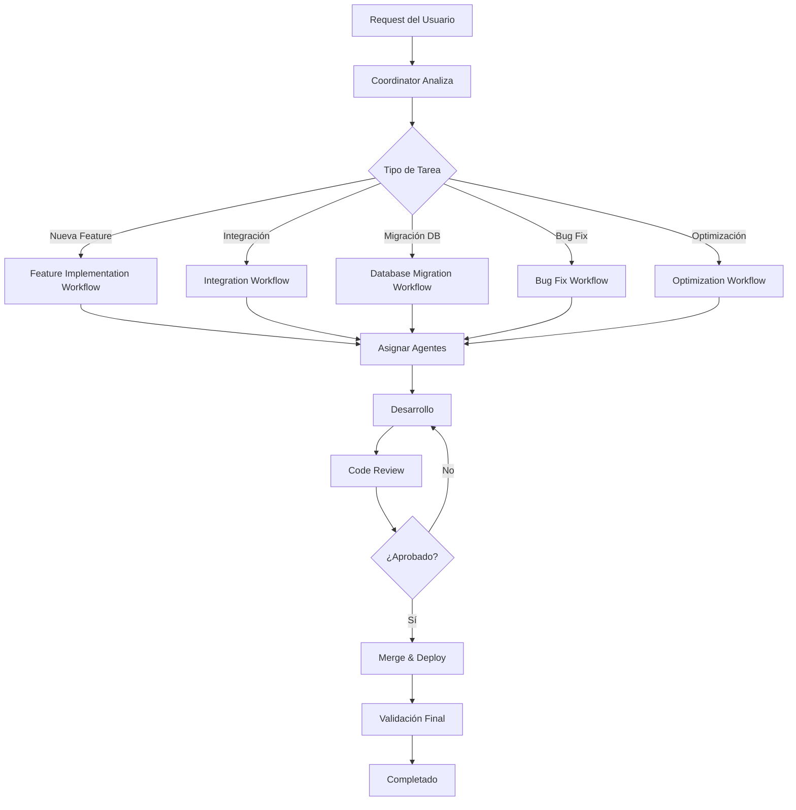

# WORKFLOWS DE COLABORACIÓN - EQUIPO DE AGENTES PODENZA

Este directorio contiene los workflows establecidos para la colaboración entre agentes en el desarrollo de PODENZA.

## 📋 Workflows Disponibles

1. **feature-implementation.md** - Implementación completa de nuevas features
2. **integration-workflow.md** - Integración con servicios externos
3. **database-migration.md** - Migraciones de base de datos
4. **code-review.md** - Proceso de revisión de código
5. **optimization.md** - Optimización de performance
6. **bug-fix.md** - Corrección de bugs

## 🎯 ¿Cómo Usar los Workflows?

### Para el Coordinator
Cuando recibas un request, determina qué workflow aplica y sigue los pasos definidos.

### Para Agentes Especializados
Consulta el workflow correspondiente para entender tu rol en el proceso.

### Para el Usuario
Estos workflows aseguran que todas las implementaciones sigan un proceso consistente y de calidad.

## 🔄 Flujo General



## 📊 Matriz de Decisión de Workflows

| Tipo de Request | Workflow a Usar | Agentes Involucrados | Duración Estimada |
|----------------|-----------------|---------------------|-------------------|
| Nueva feature frontend | Feature Implementation | fullstack-dev, security-qa | 2-5 días |
| Nueva feature fullstack | Feature Implementation | fullstack-dev, db-integration, security-qa | 3-7 días |
| Integración API externa | Integration Workflow | db-integration, fullstack-dev, security-qa | 3-5 días |
| Nueva tabla / Migración | Database Migration | db-integration, security-qa | 1-3 días |
| Automatización con IA | Feature Implementation | ai-automation, security-qa | 3-7 días |
| Bug crítico | Bug Fix | [según área], security-qa | 0.5-2 días |
| Optimización performance | Optimization | db-integration, fullstack-dev, security-qa | 2-5 días |
| Code review | Code Review | security-qa | 0.5-1 día |

## 🎯 Roles por Workflow

### Feature Implementation
- **Coordinator**: Orquesta el proceso completo
- **fullstack-dev**: Implementa UI y lógica
- **db-integration**: Crea schema y migraciones si es necesario
- **ai-automation**: Agrega automatizaciones si aplica
- **security-qa**: Revisa seguridad y calidad

### Integration Workflow
- **Coordinator**: Orquesta y valida completitud
- **db-integration**: Implementa cliente de API y webhooks
- **fullstack-dev**: Crea UI de configuración
- **security-qa**: Valida security best practices

### Database Migration
- **Coordinator**: Supervisa proceso
- **db-integration**: Diseña y ejecuta migración
- **security-qa**: Valida RLS y security

### Optimization
- **Coordinator**: Coordina esfuerzos
- **security-qa**: Identifica bottlenecks
- **db-integration**: Optimiza queries y DB
- **fullstack-dev**: Optimiza frontend

## ⚠️ Reglas Importantes

### 1. NUNCA Saltar el Code Review
Todas las implementaciones DEBEN pasar por @security-qa antes de merge.

### 2. SIEMPRE Consultar Contexto
Antes de iniciar, leer los documentos de /Context/Rules/ relevantes.

### 3. SIEMPRE Validar Multi-Tenant
Toda feature nueva debe validarse para tenant isolation.

### 4. SIEMPRE Documentar
Actualizar Plan-de-Trabajo.md y documentación relevante.

## 📝 Template para Nuevo Workflow

Si necesitas crear un workflow nuevo, usa esta estructura:

```markdown
# [NOMBRE DEL WORKFLOW]

## 🎯 Objetivo
[Descripción del objetivo]

## 📋 Pre-requisitos
- [ ] Requisito 1
- [ ] Requisito 2

## 👥 Agentes Involucrados
- **agente1**: Rol específico
- **agente2**: Rol específico

## 🔄 Pasos del Workflow

### 1. [Paso 1]
**Responsable**: [agente]
**Duración estimada**: [tiempo]
**Entregable**: [qué se espera]

### 2. [Paso 2]
...

## ✅ Criterios de Aceptación
- [ ] Criterio 1
- [ ] Criterio 2

## 📊 Métricas de Éxito
- Métrica 1: target
- Métrica 2: target
```

---

**Versión**: 1.0
**Última actualización**: 2025-01-23
**Mantenido por**: PODENZA Development Team
